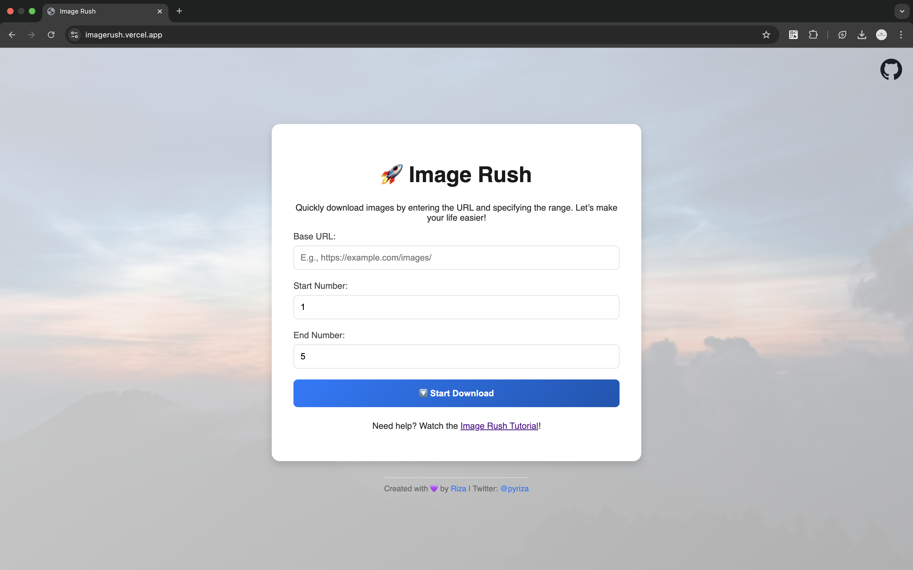

  <h1><code>ImageRush</code></h1>
  
<strong>A sleek, fast, and user-friendly image downloader that makes grabbing images from any URL a breeze!<a href="https://imagerush.vercel.app/"> ImageRush</a></strong>

  

  <table>
    <tr>
      <td></td>
    </tr>
  </table>

## 📖 Table of Contents

- [Introduction](#ℹ️-introduction)
- [Features](#🔥-features)
- [Usage](#🚀-usage)
- [Contribution](#🤝-contribution)
- [License](#📜-license)

---

## ℹ️ Introduction

**ImageRush** is your go-to tool for downloading images effortlessly. Just provide the base URL and specify the range, and let the magic happen! Whether you're working on a project or just hoarding memes, **ImageRush** has got your back. 🌟

---

## 🔥 Features

- **One-Click Downloads:** Grab all the images you need with a single click.  
- **Custom Range Selection:** Specify the image range—no unnecessary downloads.  
- **Progress Updates:** Watch your images load as the magic unfolds.  

---

## 🚀 Usage

### Tutorial

  

1. **Enter Base URL:** Provide the URL where your images are stored.  
   Example: `https://example.com/images/`

2. **Set Image Range:** Choose the start and end numbers.  
   Example: From `1` to `20`.

3. **Download:** Click "Download Images" and let **ImageRush** do the heavy lifting.  

---

## 🤝 Contribution

Want to make **ImageRush** even better? Here's how you can help:  

- Report bugs or suggest features.  
- Fork the repo, make changes, and open a pull request.  
- Share the tool with your friends and community.  

---

## 📜 License

Licensed under the MIT License. See [LICENSE](LICENSE) for details.  

---
